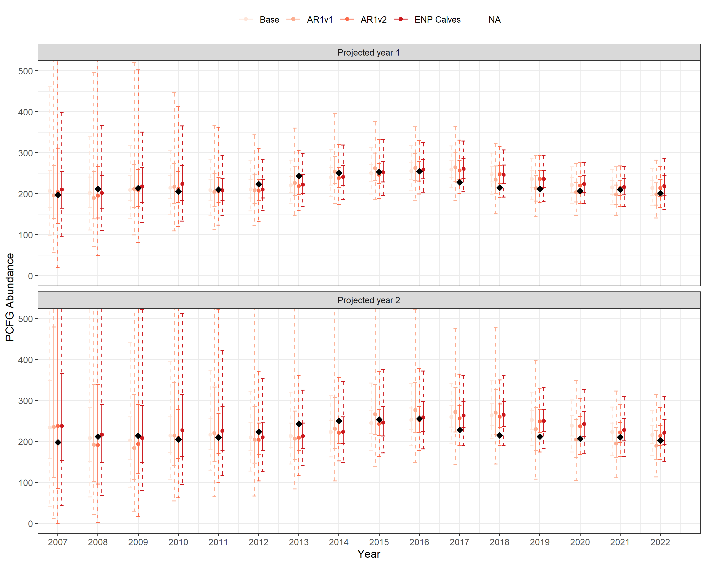

# Projecting PCFG Gray Whale Abundance

# Description of model set

The abundance of gray whales within the Pacific Coast Feeding Group
(PCFG) - a subset of the broader Eastern North Pacific (ENP)
population - is estimated within a Jolly-Seber modeling framework using
data derived from yearly mark-resight surveys (Harris et al. 2024). Due
to the time required to match individuals from many hundreds of
sightings each year to an extensive photographic catalog, the most
recent abundance estimates often lag behind the current calendar year by
one or more years. However, management decisions are contingent upon
abundance estimates for PCFG gray whales through the current calendar
year or into the next. To meet this need, we implemented a Bayesian
state-space model (SSM) to predict abundance beyond the last year for
which PCFG abundance was estimated. The SSM models abundance in
log-space with Gaussian errors and can be defined as the following:

*Observation process:*

")

*State process:*

")

 \sim normal(\mu, \sigma)")

Where  and

are the estimated (log) population abundance and standard error for each
year with observation data, respectively. Models vary by the
specification of
 and
the factors hypothesized to be correlated with population growth, at
least given current knowledge and available data within this system. At
present, seven models were considered.

1.  Base:
    }; \sigma = \sigma_{ln(\lambda)}")
2.  AR1v1:
    ; \sigma = \sigma_{ln(\lambda)}")
3.  AR2v2:
    } + ln(\lambda_{t-1}) * \beta; \sigma = \sigma_{ln(\lambda)}")
4.  ENP calves:
    } + \beta_{calves} * C_{t}; \sigma = \sigma_{ln(\lambda)}")
5.  (PCFG) Calves only:
    } + \beta_{calves} * C_{t}; \sigma = \sigma_{ln(\lambda)}")
6.  (ENP) Strandings only:
    } + \beta_{strand} * S_{t}; \sigma = \sigma_{ln(\lambda)}")
7.  (PCFG) Calves + Strandings:
    } + \beta_{calves} * C_{t} + \beta_{strand} * S_{t}; \sigma = \sigma_{ln(\lambda)}")

<!--#
&#10;1. Base: $ln(\lambda_{t}) \sim normal(\mu_{ln(\lambda)}, \sigma_{ln(\lambda)})$ 
2. AR1v1: $ln(\lambda_{t}) \sim normal(ln(\lambda_{t-1}), \sigma_{ln(\lambda_{t})})$ 
3. AR2v2: $ln(\lambda_{t}) \sim normal(\mu_{ln(\lambda_{t})} + ln(\lambda_{t-1}) * \beta, \sigma_{ln(\lambda_{t})})$ 
4. ENP calves: $ln(\lambda_{t}) \sim normal(\mu_{ln(\lambda_{t})} + C_{t} * \beta_{calves}, \sigma_{ln(\lambda_{t})})$ 
5. (PCFG) Calves only: $ln(\lambda_{t}) \sim normal(\mu_{ln(\lambda_{t})} + C_{t} * \beta_{calves}, \sigma_{ln(\lambda_{t})})$ 
6. (ENP) Strandings only: $ln(\lambda_{t}) \sim normal(\mu_{ln\lambda} + S_{t} * \beta_{strand}, \sigma_{ln\lambda})$ 
7. (PCFG) Calves + Strandings: $ln(\lambda_{t}) \sim normal(\mu_{ln(\lambda_{t})} + C_{t} * \beta_{calves} + S_{t} * \beta_{strand}, \sigma_{ln(\lambda_{t})})$
&#10;-->

corresponds the number of calves in year *t* (either ENP or PCFG);

corresponds to the number of ENP strandings in year *t*.

### Additional prior specifications

Where appropriate, the following weakly informative hyper-priors were
implemented for both mean and scale parameters in the
")
priors.

} \sim normal(0, 1)")

} \sim lognormal(0, 1)")

Importantly,
}")
is constrained to be positive. For models with beta coefficients (models
4 - 7), additional normal priors are specified for each coefficient, *i*
(e.g.,
"),
ENP calves, PCFG calves, or number of strandings). At present, no
hyper-priors were used for coefficients.

")

# Model fitting diagnostics

The table below provides various chain-specific diagnostics by model
specification. Chains with few to no divergences (num_divergent) and
that do not hit maximum tree depth (num_max_treedepth) indicate adequate
sampling of posteriors and overall good chain performance. Similarly, an
estimated Bayesian fraction of missing information (ebfmi) greater than
0.3 suggests reliable inference can be drawn from posterior estimates.

| Model                        | chain | num_divergent | num_max_treedepth | ebfmi |
|:-----------------------------|:-----:|:-------------:|:-----------------:|:-----:|
| Base                         |   1   |       0       |         0         | 0.47  |
| Base                         |   2   |       0       |         0         | 0.51  |
| Base                         |   3   |       0       |         0         | 0.33  |
| AR1v1                        |   1   |       0       |         0         | 0.35  |
| AR1v1                        |   2   |       0       |         0         | 0.33  |
| AR1v1                        |   3   |       0       |         0         | 0.31  |
| AR1v2                        |   1   |       0       |         0         | 0.54  |
| AR1v2                        |   2   |       0       |         0         | 0.53  |
| AR1v2                        |   3   |       0       |         0         | 0.51  |
| ENP Calves                   |   1   |       0       |         0         | 0.65  |
| ENP Calves                   |   2   |       0       |         0         | 0.59  |
| ENP Calves                   |   3   |       0       |         0         | 0.68  |
| PCFG Calves only             |   1   |       0       |         0         | 0.48  |
| PCFG Calves only             |   2   |       0       |         0         | 0.50  |
| PCFG Calves only             |   3   |       0       |         0         | 0.52  |
| ENP Strandings only          |   1   |       1       |         0         | 0.35  |
| ENP Strandings only          |   2   |       0       |         0         | 0.35  |
| ENP Strandings only          |   3   |       0       |         0         | 0.38  |
| PCFG Calves + ENP Strandings |   1   |       0       |         0         | 0.33  |
| PCFG Calves + ENP Strandings |   2   |       0       |         0         | 0.38  |
| PCFG Calves + ENP Strandings |   3   |       0       |         0         | 0.46  |

# Model results

## Coefficient estimates

coefficient estimates for models where coefficients on

were estimated.
 and

correspond to the lower and upper 95% credible intervals.
 values less
than 1.01 indicate effective mixing within and across chains, producing
reliable and consistent estimates for the parameters.
 is the effective
sample size and is an indicator of chain sampling efficiency. Here,
 values greater
than 300 indicate sufficient sampling has been achieved.

| model                        |                                                      variable                                                       |  mean  | median |  sd   | lo_ci  | hi_ci | rhat  | ess_bulk |
|:-----------------------------|:-------------------------------------------------------------------------------------------------------------------:|:------:|:------:|:-----:|:------:|:-----:|:-----:|:--------:|
| AR1v2                        | }") | -0.167 | -0.170 | 0.382 | -0.784 | 0.463 | 1.004 |  758.2   |
| ENP Calves                   |                       | -0.004 | -0.004 | 0.036 | -0.064 | 0.055 | 1.000 |  1447.6  |
| PCFG Calves only             |                       | 0.020  | 0.019  | 0.019 | -0.010 | 0.051 | 1.001 |  2793.6  |
| ENP Strandings only          |           | -0.002 | -0.002 | 0.001 | -0.004 | 0.001 | 1.000 |  2198.9  |
| PCFG Calves + ENP Strandings |                       | 0.017  | 0.016  | 0.020 | -0.016 | 0.050 | 1.004 |  2694.3  |
| PCFG Calves + ENP Strandings |           | -0.001 | -0.001 | 0.002 | -0.004 | 0.001 | 1.002 |  1998.7  |

## Leave-one-out Cross Validation (LOO)

The following table provides estimates of model fit using an information
criterion (leave-one-out information criterion; *looic*) based on
leave-one-out cross validation. Models with the lowest
 value are
considered the best fitting model given the time series of abundance
data used to fit the model.

represents the difference in
 relative to
the model with the lowest
.

| Model                        | elpd_loo | elpd_loo_se | p_loo | p_loo_se | looic  | looic_se | deltaLooic |
|:-----------------------------|:--------:|:-----------:|:-----:|:--------:|:------:|:--------:|:----------:|
| AR1v1                        |  25.55   |    0.85     | 2.37  |   0.61   | -51.11 |   1.70   |    0.00    |
| PCFG Calves only             |  24.78   |    0.65     | 2.84  |   0.54   | -49.56 |   1.31   |    1.54    |
| ENP Strandings only          |  24.44   |    0.79     | 2.88  |   0.45   | -48.89 |   1.57   |    2.22    |
| PCFG Calves + ENP Strandings |  24.32   |    0.74     | 3.09  |   0.53   | -48.65 |   1.49   |    2.46    |
| Base                         |  24.22   |    0.71     | 3.11  |   0.65   | -48.44 |   1.42   |    2.66    |
| ENP Calves                   |  23.86   |    0.74     | 3.37  |   0.54   | -47.71 |   1.48   |    3.39    |
| AR1v2                        |  23.34   |    0.68     | 3.73  |   0.66   | -46.69 |   1.36   |    4.42    |

## Predictive accuracy with retrospection

Given the primary objective of this exercise was prediction, we
evaluated each models ability to retrospectively predict a future, known
population abundance using the PCFG abundance time series from Harris et
al. 2024. Predicting future states or “forecasting” is notoriously
challenging, particularly as we project further into the future.
However, within this system, data gaps of one or two years represent the
most plausible scenarios managers are likely to encounter, providing the
basis for our evaluation. In addition, we anticipated relative
performance within model sets was likely to vary as we project further
into the future. Thus, we evaluated model performance when projected one
or two years separately. Finally, we evaluated model predictive
performance using models fitted to both truncated and complete abundance
time series. The latter provides the best available knowledge of the
system for model fitting, but might bias retrospective evaluations of
predictive performance due to information “spillover” from future
population states. The former can become data limited and select for
overly simplistic models.

All time series used in model fitting started with estimates from 2002,
but varied in their end point. In the case of the truncated times
series, we fit each of the seven models specified above to multiple time
series with varying end points from 2006 through 2021, providing
projected abundance estimates for years 2007 through 2022. Notably, 2006
was used as the earliest end point to provide at least some information
for models to converge. In the case of the complete time series, we fit
all seven models to a single time series representing abundance data
from 2002 through 2022. Model parameters were then used to
retrospectively project abundance forward one or two years from 2002
through 2021, providing projected abundance estimates for years 2003
through 2022.

In all cases, projected estimates were then compared to “observed”
abundance in the same year using residual sum of squares (RSS), 60% and
95% credible intervals, and whether an estimate dropped below threshold
resulting in a presumed hunt closure. Predictive fits were summarized by
one or two year projection lengths.

### *Model fits derived from truncated time series*

The following tables show predictive performance statistics by model
specification when predicting one or two years forward (respectively)
from all data years between 2006 and 2021. RSS is the residual sum of
squares.

| Model                        |   Mean RSS   | Mean Percentile (N) | Median Percentile (N) | Mean Prop Below Threshold (N) | Median Prop Below Threshold (N) | Number of Closures |         Closure Years         |
|:-----------------------------|:------------:|:-------------------:|:---------------------:|:-----------------------------:|:-------------------------------:|:------------------:|:-----------------------------:|
| Base                         |    281.7     |         0.4         |         0.455         |             0.148             |              0.106              |         2          |           2007,2008           |
| AR1v1                        |    314.6     |         0.5         |         0.513         |             0.268             |              0.320              |         4          |      2007,2008,2009,2011      |
| ENP Calves                   |    323.0     |         0.4         |         0.428         |             0.158             |              0.134              |         2          |           2007,2008           |
| ENP Strandings only          |    445.2     |         0.6         |         0.601         |             0.284             |              0.271              |         4          |      2007,2008,2019,2020      |
| PCFG Calves + ENP Strandings |    780.5     |         0.5         |         0.516         |             0.311             |              0.309              |         6          | 2007,2008,2011,2012,2019,2020 |
| PCFG Calves only             |    835.6     |         0.4         |         0.401         |             0.180             |              0.172              |         2          |           2007,2008           |
| AR1v2                        | 4080217316.5 |         0.5         |         0.496         |             0.189             |              0.159              |         3          |        2007,2008,2009         |

| Model                        |   Mean RSS   | Mean Percentile (N) | Median Percentile (N) | Mean Prop Below Threshold (N) | Median Prop Below Threshold (N) | Number of Closures |                     Closure Years                      |
|:-----------------------------|:------------:|:-------------------:|:---------------------:|:-----------------------------:|:-------------------------------:|:------------------:|:------------------------------------------------------:|
| Base                         | 4.526700e+03 |         0.4         |         0.433         |             0.187             |              0.152              |         3          |                     2007,2008,2009                     |
| ENP Calves                   | 6.076200e+03 |         0.4         |         0.396         |             0.198             |              0.195              |         4          |                  2007,2008,2009,2010                   |
| PCFG Calves only             | 7.563180e+04 |         0.4         |         0.380         |             0.220             |              0.220              |         5          |                2007,2008,2009,2012,2013                |
| ENP Strandings only          | 6.271720e+05 |         0.6         |         0.578         |             0.363             |              0.345              |         8          |        2007,2008,2009,2010,2019,2020,2021,2022         |
| AR1v1                        | 2.375914e+07 |         0.5         |         0.491         |             0.336             |              0.398              |         10         |   2007,2008,2009,2010,2011,2012,2013,2020,2021,2022    |
| PCFG Calves + ENP Strandings | 2.197542e+13 |         0.5         |         0.486         |             0.388             |              0.379              |         11         | 2007,2008,2009,2010,2011,2012,2013,2019,2020,2021,2022 |
| AR1v2                        | 4.718225e+91 |         0.4         |         0.476         |             0.232             |              0.200              |         6          |             2007,2008,2009,2010,2011,2012              |

The following figure depicts the predictive fits when abundance was
projected forward one (top panel) or two years (bottom panel) for all
model specifications in a truncated time series context. Observed
abundance estimates for years 2007 through 2022 are represented as back
diamonds, median model predictions are represented by points, 60%
credible intervals are depicted as solid error bars, and the 95%
credible intervals are depicted as dashed error bars .

However, as is evident in the figure above, the reduced confidence in
predictions prior to 2014 is likely - at least in part - being driven by
data limitations due the shorter time series used in model fitting.
Therefore, the two summary tables for model predictive performance are
provided again for all data years between 2013 and 2021.

| Model                        | Mean RSS | Mean Percentile (N) | Median Percentile (N) | Mean Prop Below Threshold (N) | Median Prop Below Threshold (N) | Number of Closures | Closure Years |
|:-----------------------------|:--------:|:-------------------:|:---------------------:|:-----------------------------:|:-------------------------------:|:------------------:|:-------------:|
| AR1v1                        |  273.9   |         0.4         |         0.464         |             0.195             |              0.143              |         0          |               |
| PCFG Calves only             |  320.1   |         0.3         |         0.374         |             0.078             |              0.030              |         0          |               |
| AR1v2                        |  341.9   |         0.4         |         0.320         |             0.073             |              0.063              |         0          |               |
| Base                         |  355.5   |         0.3         |         0.297         |             0.053             |              0.022              |         0          |               |
| ENP Calves                   |  396.6   |         0.3         |         0.280         |             0.064             |              0.037              |         0          |               |
| PCFG Calves + ENP Strandings |  501.2   |         0.5         |         0.524         |             0.285             |              0.068              |         2          |   2019,2020   |
| ENP Strandings only          |  657.8   |         0.6         |         0.639         |             0.283             |              0.048              |         2          |   2019,2020   |

| Model                        |  Mean RSS   | Mean Percentile (N) | Median Percentile (N) | Mean Prop Below Threshold (N) | Median Prop Below Threshold (N) | Number of Closures |    Closure Years    |
|:-----------------------------|:-----------:|:-------------------:|:---------------------:|:-----------------------------:|:-------------------------------:|:------------------:|:-------------------:|
| PCFG Calves only             | 8.04600e+02 |         0.3         |         0.361         |             0.104             |              0.058              |         0          |                     |
| Base                         | 8.35500e+02 |         0.3         |         0.295         |             0.071             |              0.053              |         0          |                     |
| PCFG Calves + ENP Strandings | 9.47500e+02 |         0.6         |         0.492         |             0.369             |              0.203              |         4          | 2019,2020,2021,2022 |
| ENP Calves                   | 9.58600e+02 |         0.3         |         0.284         |             0.093             |              0.085              |         0          |                     |
| AR1v1                        | 1.16260e+03 |         0.4         |         0.417         |             0.259             |              0.255              |         3          |   2020,2021,2022    |
| ENP Strandings only          | 1.26780e+03 |         0.7         |         0.704         |             0.372             |              0.162              |         4          | 2019,2020,2021,2022 |
| AR1v2                        | 7.86467e+10 |         0.4         |         0.342         |             0.099             |              0.077              |         0          |                     |

### *Model fits derived from full time series*

The following tables show predictive performance statistics by model
specification when predicting one or two years forward (respectively)
for all data years from 2002 through 2021. RSS is the residual sum of
squares.

| Model                        | Mean RSS | Mean Percentile (N) | Median Percentile (N) | Mean Prop Below Threshold (N) | Median Prop Below Threshold (N) | Number of Closures | Closure Years |
|:-----------------------------|:--------:|:-------------------:|:---------------------:|:-----------------------------:|:-------------------------------:|:------------------:|:-------------:|
| AR1v1                        |   40.8   |        0.519        |         0.583         |             0.123             |              0.145              |         0          |               |
| PCFG Calves only             |   66.7   |        0.522        |         0.528         |             0.138             |              0.165              |         0          |               |
| PCFG Calves + ENP Strandings |   67.4   |        0.521        |         0.571         |             0.145             |              0.158              |         0          |               |
| AR1v2                        |   84.9   |        0.514        |         0.526         |             0.121             |              0.137              |         0          |               |
| ENP Strandings only          |   89.5   |        0.518        |         0.569         |             0.122             |              0.113              |         0          |               |
| Base                         |   93.0   |        0.513        |         0.530         |             0.110             |              0.130              |         0          |               |
| ENP Calves                   |   93.8   |        0.527        |         0.542         |             0.126             |              0.148              |         0          |               |

| Model                        | Mean RSS | Mean Percentile (N) | Median Percentile (N) | Mean Prop Below Threshold (N) | Median Prop Below Threshold (N) | Number of Closures | Closure Years |
|:-----------------------------|:--------:|:-------------------:|:---------------------:|:-----------------------------:|:-------------------------------:|:------------------:|:-------------:|
| AR1v1                        |   38.8   |        0.500        |         0.512         |             0.203             |              0.223              |         0          |               |
| PCFG Calves + ENP Strandings |  140.5   |        0.509        |         0.512         |             0.188             |              0.234              |         0          |               |
| PCFG Calves only             |  153.7   |        0.509        |         0.519         |             0.185             |              0.183              |         0          |               |
| ENP Strandings only          |  176.4   |        0.509        |         0.576         |             0.154             |              0.154              |         0          |               |
| AR1v2                        |  194.6   |        0.509        |         0.469         |             0.163             |              0.176              |         0          |               |
| Base                         |  218.8   |        0.504        |         0.465         |             0.147             |              0.178              |         0          |               |
| ENP Calves                   |  221.1   |        0.512        |         0.459         |             0.165             |              0.183              |         0          |               |

The following figure depicts the predictive fits when abundance was
projected forward one (top panel) or two years (bottom panel) for all
model specifications. Observed abundance estimates for years 2003
through 2022 are represented as back diamonds, median model predictions
are represented by points, 60% credible intervals are depicted as solid
error bars, and the 95% credible intervals are depicted as dashed error
bars .

## Model-specific trends and projections

Note, the number of PCFG calves used in projected years (models
calves/strandings and calves only) are not accurate and likely represent
underestimates of reality.

## Model-specific predictions for Yfinal + 2

## Supplementary tables

Model predictions when projecting one year forward for all data years
from 2002 through 2021 using models fit to the full time series. RSS is
the residual sum of squares.

| Year | Model                        | Abundance Estimate | Mean N | Median N | Lower 95% CI (N) | Upper 95% CI (N) | Nmin  | Closure | Percentile for Abundance Estimate | Prop Below Threshold (N) | Prop Below Threshold (Nmin) |
|:-----|:-----------------------------|:------------------:|:------:|:--------:|:----------------:|:----------------:|:-----:|:-------:|:---------------------------------:|:------------------------:|:---------------------------:|
| 2003 | Base                         |       208.7        | 200.4  |  200.4   |      168.5       |      234.3       | 187.4 |  FALSE  |               0.716               |          0.295           |            0.033            |
| 2003 | AR1v1                        |       208.7        | 205.2  |  204.0   |      171.2       |      247.1       | 191.1 |  FALSE  |               0.618               |          0.218           |            0.024            |
| 2003 | AR1v2                        |       208.7        | 199.5  |  198.4   |      165.1       |      239.2       | 184.5 |  FALSE  |               0.711               |          0.348           |            0.056            |
| 2003 | ENP Calves                   |       208.7        | 199.4  |  199.0   |      166.6       |      235.8       | 185.4 |  FALSE  |               0.723               |          0.329           |            0.042            |
| 2003 | PCFG Calves only             |       208.7        | 199.7  |  199.1   |      167.0       |      235.5       | 186.5 |  FALSE  |               0.724               |          0.325           |            0.037            |
| 2003 | ENP Strandings only          |       208.7        | 202.1  |  201.6   |      171.8       |      233.3       | 189.6 |  FALSE  |               0.677               |          0.250           |            0.020            |
| 2003 | PCFG Calves + ENP Strandings |       208.7        | 201.0  |  200.6   |      166.4       |      236.5       | 187.2 |  FALSE  |               0.693               |          0.291           |            0.040            |
| 2004 | Base                         |       214.9        | 206.3  |  205.6   |      173.1       |      244.8       | 192.1 |  FALSE  |               0.714               |          0.198           |            0.020            |
| 2004 | AR1v1                        |       214.9        | 209.0  |  207.1   |      175.2       |      251.9       | 194.8 |  FALSE  |               0.674               |          0.153           |            0.014            |
| 2004 | AR1v2                        |       214.9        | 210.8  |  209.4   |      174.0       |      254.6       | 194.3 |  FALSE  |               0.609               |          0.165           |            0.015            |
| 2004 | ENP Calves                   |       214.9        | 205.9  |  205.3   |      170.1       |      247.6       | 191.5 |  FALSE  |               0.716               |          0.211           |            0.028            |
| 2004 | PCFG Calves only             |       214.9        | 205.9  |  205.0   |      171.6       |      245.4       | 191.5 |  FALSE  |               0.711               |          0.207           |            0.023            |
| 2004 | ENP Strandings only          |       214.9        | 209.0  |  208.0   |      175.5       |      248.3       | 195.4 |  FALSE  |               0.671               |          0.138           |            0.014            |
| 2004 | PCFG Calves + ENP Strandings |       214.9        | 208.6  |  207.8   |      173.8       |      248.6       | 193.9 |  FALSE  |               0.666               |          0.172           |            0.018            |
| 2005 | Base                         |       220.0        | 210.1  |  208.5   |      177.1       |      249.3       | 195.9 |  FALSE  |               0.738               |          0.136           |            0.011            |
| 2005 | AR1v1                        |       220.0        | 209.3  |  208.0   |      172.8       |      253.6       | 194.6 |  FALSE  |               0.752               |          0.159           |            0.023            |
| 2005 | AR1v2                        |       220.0        | 211.0  |  210.3   |      172.6       |      253.3       | 195.2 |  FALSE  |               0.705               |          0.154           |            0.021            |
| 2005 | ENP Calves                   |       220.0        | 209.8  |  208.5   |      174.1       |      253.2       | 194.5 |  FALSE  |               0.737               |          0.162           |            0.018            |
| 2005 | PCFG Calves only             |       220.0        | 208.8  |  207.7   |      176.6       |      248.3       | 193.9 |  FALSE  |               0.756               |          0.166           |            0.014            |
| 2005 | ENP Strandings only          |       220.0        | 211.3  |  210.1   |      179.0       |      252.0       | 197.4 |  FALSE  |               0.725               |          0.124           |            0.011            |
| 2005 | PCFG Calves + ENP Strandings |       220.0        | 210.3  |  209.4   |      175.1       |      248.6       | 195.9 |  FALSE  |               0.728               |          0.132           |            0.014            |
| 2006 | Base                         |       199.2        | 209.6  |  208.8   |      174.3       |      251.3       | 194.7 |  FALSE  |               0.284               |          0.159           |            0.017            |
| 2006 | AR1v1                        |       199.2        | 207.7  |  206.9   |      171.1       |      251.0       | 192.7 |  FALSE  |               0.324               |          0.190           |            0.024            |
| 2006 | AR1v2                        |       199.2        | 210.9  |  210.4   |      170.6       |      254.4       | 194.3 |  FALSE  |               0.278               |          0.169           |            0.027            |
| 2006 | ENP Calves                   |       199.2        | 209.5  |  207.9   |      173.3       |      254.4       | 193.0 |  FALSE  |               0.318               |          0.187           |            0.018            |
| 2006 | PCFG Calves only             |       199.2        | 206.7  |  205.4   |      170.4       |      250.3       | 191.0 |  FALSE  |               0.353               |          0.211           |            0.028            |
| 2006 | ENP Strandings only          |       199.2        | 210.7  |  209.4   |      176.9       |      250.4       | 196.9 |  FALSE  |               0.248               |          0.130           |            0.012            |
| 2006 | PCFG Calves + ENP Strandings |       199.2        | 207.9  |  207.5   |      171.8       |      249.5       | 192.4 |  FALSE  |               0.321               |          0.191           |            0.024            |
| 2007 | Base                         |       197.7        | 207.3  |  207.1   |      169.4       |      247.2       | 193.0 |  FALSE  |               0.286               |          0.185           |            0.029            |
| 2007 | AR1v1                        |       197.7        | 207.3  |  206.8   |      171.5       |      247.5       | 192.2 |  FALSE  |               0.299               |          0.197           |            0.024            |
| 2007 | AR1v2                        |       197.7        | 208.4  |  208.0   |      168.7       |      251.0       | 191.9 |  FALSE  |               0.295               |          0.201           |            0.032            |
| 2007 | ENP Calves                   |       197.7        | 206.3  |  205.5   |      168.1       |      249.2       | 189.9 |  FALSE  |               0.331               |          0.228           |            0.035            |
| 2007 | PCFG Calves only             |       197.7        | 204.0  |  203.2   |      168.1       |      243.6       | 188.8 |  FALSE  |               0.372               |          0.255           |            0.036            |
| 2007 | ENP Strandings only          |       197.7        | 206.8  |  206.5   |      173.1       |      243.9       | 192.7 |  FALSE  |               0.292               |          0.189           |            0.020            |
| 2007 | PCFG Calves + ENP Strandings |       197.7        | 203.9  |  203.8   |      168.5       |      241.9       | 188.9 |  FALSE  |               0.364               |          0.247           |            0.034            |
| 2008 | Base                         |       211.8        | 208.1  |  207.8   |      169.9       |      248.7       | 193.0 |  FALSE  |               0.592               |          0.188           |            0.028            |
| 2008 | AR1v1                        |       211.8        | 207.8  |  207.2   |      171.5       |      247.9       | 193.2 |  FALSE  |               0.603               |          0.179           |            0.023            |
| 2008 | AR1v2                        |       211.8        | 209.2  |  208.2   |      170.4       |      250.6       | 192.9 |  FALSE  |               0.577               |          0.187           |            0.027            |
| 2008 | ENP Calves                   |       211.8        | 206.5  |  206.1   |      169.2       |      248.1       | 190.9 |  FALSE  |               0.624               |          0.216           |            0.031            |
| 2008 | PCFG Calves only             |       211.8        | 203.5  |  202.9   |      167.5       |      242.8       | 188.3 |  FALSE  |               0.689               |          0.268           |            0.042            |
| 2008 | ENP Strandings only          |       211.8        | 207.6  |  207.1   |      172.4       |      246.3       | 193.7 |  FALSE  |               0.610               |          0.175           |            0.022            |
| 2008 | PCFG Calves + ENP Strandings |       211.8        | 204.0  |  203.7   |      166.6       |      245.5       | 188.7 |  FALSE  |               0.677               |          0.249           |            0.039            |
| 2009 | Base                         |       213.8        | 210.5  |  210.1   |      174.4       |      251.9       | 195.5 |  FALSE  |               0.591               |          0.153           |            0.018            |
| 2009 | AR1v1                        |       213.8        | 209.7  |  209.4   |      173.1       |      248.2       | 195.3 |  FALSE  |               0.610               |          0.147           |            0.019            |
| 2009 | AR1v2                        |       213.8        | 211.0  |  210.4   |      170.9       |      255.1       | 194.3 |  FALSE  |               0.573               |          0.164           |            0.025            |
| 2009 | ENP Calves                   |       213.8        | 210.0  |  209.3   |      173.8       |      250.1       | 194.8 |  FALSE  |               0.603               |          0.157           |            0.021            |
| 2009 | PCFG Calves only             |       213.8        | 205.1  |  204.6   |      168.5       |      244.7       | 190.1 |  FALSE  |               0.701               |          0.237           |            0.032            |
| 2009 | ENP Strandings only          |       213.8        | 213.2  |  213.1   |      176.5       |      251.3       | 198.5 |  FALSE  |               0.519               |          0.118           |            0.016            |
| 2009 | PCFG Calves + ENP Strandings |       213.8        | 208.6  |  208.1   |      171.9       |      251.1       | 192.5 |  FALSE  |               0.623               |          0.193           |            0.021            |
| 2010 | Base                         |       205.3        | 211.9  |  211.1   |      175.2       |      252.2       | 196.6 |  FALSE  |               0.365               |          0.145           |            0.017            |
| 2010 | AR1v1                        |       205.3        | 211.7  |  212.0   |      172.0       |      251.2       | 196.5 |  FALSE  |               0.351               |          0.143           |            0.022            |
| 2010 | AR1v2                        |       205.3        | 212.5  |  211.6   |      175.8       |      253.3       | 196.0 |  FALSE  |               0.370               |          0.143           |            0.013            |
| 2010 | ENP Calves                   |       205.3        | 212.0  |  211.1   |      173.4       |      255.9       | 195.3 |  FALSE  |               0.373               |          0.152           |            0.020            |
| 2010 | PCFG Calves only             |       205.3        | 207.2  |  206.2   |      170.2       |      249.2       | 191.3 |  FALSE  |               0.479               |          0.209           |            0.028            |
| 2010 | ENP Strandings only          |       205.3        | 214.3  |  214.4   |      178.7       |      252.7       | 199.5 |  FALSE  |               0.300               |          0.105           |            0.010            |
| 2010 | PCFG Calves + ENP Strandings |       205.3        | 210.1  |  209.4   |      172.4       |      252.4       | 194.3 |  FALSE  |               0.410               |          0.165           |            0.022            |
| 2011 | Base                         |       209.9        | 213.2  |  213.4   |      176.7       |      251.2       | 198.5 |  FALSE  |               0.422               |          0.123           |            0.013            |
| 2011 | AR1v1                        |       209.9        | 217.8  |  217.8   |      180.7       |      255.8       | 203.6 |  FALSE  |               0.321               |          0.082           |            0.011            |
| 2011 | AR1v2                        |       209.9        | 214.7  |  214.5   |      174.9       |      259.1       | 198.2 |  FALSE  |               0.408               |          0.131           |            0.013            |
| 2011 | ENP Calves                   |       209.9        | 214.4  |  214.1   |      172.8       |      260.5       | 196.7 |  FALSE  |               0.417               |          0.144           |            0.022            |
| 2011 | PCFG Calves only             |       209.9        | 209.1  |  208.2   |      174.2       |      248.8       | 193.8 |  FALSE  |               0.538               |          0.171           |            0.018            |
| 2011 | ENP Strandings only          |       209.9        | 213.8  |  214.0   |      176.7       |      248.5       | 199.8 |  FALSE  |               0.401               |          0.108           |            0.015            |
| 2011 | PCFG Calves + ENP Strandings |       209.9        | 210.3  |  209.8   |      173.7       |      250.3       | 195.2 |  FALSE  |               0.503               |          0.152           |            0.018            |
| 2012 | Base                         |       223.5        | 217.5  |  217.3   |      179.9       |      256.0       | 203.5 |  FALSE  |               0.650               |          0.078           |            0.009            |
| 2012 | AR1v1                        |       223.5        | 228.1  |  227.3   |      190.9       |      271.9       | 213.3 |  FALSE  |               0.407               |          0.028           |            0.005            |
| 2012 | AR1v2                        |       223.5        | 218.5  |  217.8   |      178.6       |      261.7       | 202.1 |  FALSE  |               0.621               |          0.089           |            0.009            |
| 2012 | ENP Calves                   |       223.5        | 217.8  |  217.7   |      179.7       |      259.2       | 201.2 |  FALSE  |               0.625               |          0.095           |            0.010            |
| 2012 | PCFG Calves only             |       223.5        | 218.5  |  217.5   |      181.8       |      259.9       | 203.4 |  FALSE  |               0.636               |          0.068           |            0.008            |
| 2012 | ENP Strandings only          |       223.5        | 219.8  |  220.2   |      183.0       |      256.8       | 205.4 |  FALSE  |               0.583               |          0.063           |            0.008            |
| 2012 | PCFG Calves + ENP Strandings |       223.5        | 220.4  |  219.5   |      184.0       |      262.4       | 204.8 |  FALSE  |               0.588               |          0.061           |            0.006            |
| 2013 | Base                         |       243.0        | 226.2  |  225.7   |      190.5       |      265.0       | 211.5 |  FALSE  |               0.827               |          0.030           |            0.004            |
| 2013 | AR1v1                        |       243.0        | 238.9  |  237.4   |      199.8       |      286.5       | 223.8 |  FALSE  |               0.637               |          0.013           |            0.002            |
| 2013 | AR1v2                        |       243.0        | 227.6  |  226.8   |      187.9       |      274.1       | 210.7 |  FALSE  |               0.798               |          0.038           |            0.005            |
| 2013 | ENP Calves                   |       243.0        | 226.0  |  225.6   |      189.8       |      267.1       | 210.9 |  FALSE  |               0.836               |          0.033           |            0.003            |
| 2013 | PCFG Calves only             |       243.0        | 231.9  |  230.8   |      191.4       |      278.7       | 215.2 |  FALSE  |               0.729               |          0.027           |            0.002            |
| 2013 | ENP Strandings only          |       243.0        | 229.4  |  228.5   |      194.8       |      268.8       | 215.5 |  FALSE  |               0.806               |          0.020           |            0.001            |
| 2013 | PCFG Calves + ENP Strandings |       243.0        | 233.4  |  232.4   |      195.1       |      278.1       | 217.9 |  FALSE  |               0.717               |          0.019           |            0.003            |
| 2014 | Base                         |       250.7        | 237.6  |  236.3   |      202.7       |      281.0       | 221.7 |  FALSE  |               0.775               |          0.006           |            0.000            |
| 2014 | AR1v1                        |       250.7        | 247.1  |  244.7   |      209.6       |      293.5       | 230.6 |  FALSE  |               0.612               |          0.003           |            0.001            |
| 2014 | AR1v2                        |       250.7        | 238.0  |  237.2   |      198.8       |      283.1       | 221.1 |  FALSE  |               0.749               |          0.013           |            0.001            |
| 2014 | ENP Calves                   |       250.7        | 237.9  |  236.7   |      201.2       |      285.9       | 220.9 |  FALSE  |               0.762               |          0.009           |            0.001            |
| 2014 | PCFG Calves only             |       250.7        | 249.0  |  247.2   |      208.0       |      299.2       | 230.2 |  FALSE  |               0.566               |          0.005           |            0.000            |
| 2014 | ENP Strandings only          |       250.7        | 240.3  |  238.9   |      204.3       |      280.5       | 225.3 |  FALSE  |               0.741               |          0.005           |            0.000            |
| 2014 | PCFG Calves + ENP Strandings |       250.7        | 249.1  |  247.0   |      207.3       |      302.5       | 230.3 |  FALSE  |               0.571               |          0.005           |            0.001            |
| 2015 | Base                         |       253.2        | 243.8  |  241.7   |      206.7       |      290.2       | 227.0 |  FALSE  |               0.698               |          0.004           |            0.000            |
| 2015 | AR1v1                        |       253.2        | 248.4  |  246.4   |      210.5       |      297.6       | 231.8 |  FALSE  |               0.645               |          0.003           |            0.001            |
| 2015 | AR1v2                        |       253.2        | 242.4  |  240.5   |      201.6       |      293.2       | 224.3 |  FALSE  |               0.714               |          0.010           |            0.000            |
| 2015 | ENP Calves                   |       253.2        | 243.3  |  241.3   |      200.9       |      295.1       | 225.5 |  FALSE  |               0.713               |          0.009           |            0.002            |
| 2015 | PCFG Calves only             |       253.2        | 254.2  |  252.2   |      211.6       |      306.7       | 234.7 |  FALSE  |               0.518               |          0.004           |            0.000            |
| 2015 | ENP Strandings only          |       253.2        | 245.7  |  244.3   |      208.6       |      290.5       | 229.2 |  FALSE  |               0.680               |          0.003           |            0.000            |
| 2015 | PCFG Calves + ENP Strandings |       253.2        | 254.8  |  252.6   |      211.8       |      309.3       | 235.7 |  FALSE  |               0.508               |          0.002           |            0.000            |
| 2016 | Base                         |       254.9        | 244.5  |  242.3   |      209.2       |      292.2       | 227.1 |  FALSE  |               0.712               |          0.003           |            0.000            |
| 2016 | AR1v1                        |       254.9        | 243.8  |  242.1   |      204.9       |      293.8       | 226.7 |  FALSE  |               0.736               |          0.006           |            0.001            |
| 2016 | AR1v2                        |       254.9        | 242.7  |  240.9   |      200.8       |      295.5       | 225.1 |  FALSE  |               0.740               |          0.011           |            0.001            |
| 2016 | ENP Calves                   |       254.9        | 244.7  |  242.2   |      203.6       |      299.9       | 226.3 |  FALSE  |               0.711               |          0.005           |            0.000            |
| 2016 | PCFG Calves only             |       254.9        | 251.0  |  249.2   |      209.4       |      303.0       | 232.5 |  FALSE  |               0.606               |          0.003           |            0.000            |
| 2016 | ENP Strandings only          |       254.9        | 245.4  |  243.2   |      209.6       |      291.9       | 229.0 |  FALSE  |               0.712               |          0.004           |            0.001            |
| 2016 | PCFG Calves + ENP Strandings |       254.9        | 251.1  |  249.7   |      211.4       |      300.6       | 233.1 |  FALSE  |               0.604               |          0.001           |            0.000            |
| 2017 | Base                         |       228.3        | 240.6  |  237.9   |      201.9       |      291.1       | 223.3 |  FALSE  |               0.295               |          0.010           |            0.001            |
| 2017 | AR1v1                        |       228.3        | 233.6  |  232.9   |      194.1       |      277.5       | 217.9 |  FALSE  |               0.395               |          0.022           |            0.003            |
| 2017 | AR1v2                        |       228.3        | 238.4  |  236.7   |      195.8       |      291.3       | 220.0 |  FALSE  |               0.345               |          0.018           |            0.002            |
| 2017 | ENP Calves                   |       228.3        | 240.4  |  237.7   |      197.7       |      295.9       | 221.5 |  FALSE  |               0.316               |          0.013           |            0.000            |
| 2017 | PCFG Calves only             |       228.3        | 243.2  |  242.0   |      203.6       |      290.5       | 225.5 |  FALSE  |               0.243               |          0.009           |            0.000            |
| 2017 | ENP Strandings only          |       228.3        | 243.7  |  242.1   |      204.9       |      290.4       | 227.4 |  FALSE  |               0.216               |          0.004           |            0.001            |
| 2017 | PCFG Calves + ENP Strandings |       228.3        | 245.0  |  244.1   |      204.5       |      292.4       | 227.5 |  FALSE  |               0.215               |          0.007           |            0.000            |
| 2018 | Base                         |       214.9        | 230.3  |  229.2   |      191.5       |      276.5       | 214.0 |  FALSE  |               0.215               |          0.027           |            0.003            |
| 2018 | AR1v1                        |       214.9        | 223.4  |  223.1   |      184.8       |      265.8       | 208.2 |  FALSE  |               0.318               |          0.055           |            0.007            |
| 2018 | AR1v2                        |       214.9        | 228.4  |  227.2   |      184.9       |      274.9       | 211.2 |  FALSE  |               0.260               |          0.042           |            0.006            |
| 2018 | ENP Calves                   |       214.9        | 229.9  |  228.1   |      188.7       |      279.9       | 212.0 |  FALSE  |               0.245               |          0.038           |            0.003            |
| 2018 | PCFG Calves only             |       214.9        | 231.6  |  230.8   |      191.5       |      275.4       | 215.2 |  FALSE  |               0.194               |          0.026           |            0.003            |
| 2018 | ENP Strandings only          |       214.9        | 233.2  |  232.8   |      193.4       |      276.6       | 218.0 |  FALSE  |               0.160               |          0.022           |            0.001            |
| 2018 | PCFG Calves + ENP Strandings |       214.9        | 233.6  |  233.1   |      193.9       |      278.9       | 217.1 |  FALSE  |               0.171               |          0.020           |            0.001            |
| 2019 | Base                         |       212.0        | 222.4  |  222.3   |      185.2       |      261.5       | 207.3 |  FALSE  |               0.280               |          0.049           |            0.005            |
| 2019 | AR1v1                        |       212.0        | 215.2  |  214.8   |      177.8       |      254.9       | 200.7 |  FALSE  |               0.423               |          0.098           |            0.013            |
| 2019 | AR1v2                        |       212.0        | 220.0  |  219.3   |      178.5       |      265.6       | 203.1 |  FALSE  |               0.346               |          0.077           |            0.009            |
| 2019 | ENP Calves                   |       212.0        | 221.6  |  220.6   |      181.9       |      267.8       | 204.7 |  FALSE  |               0.322               |          0.068           |            0.008            |
| 2019 | PCFG Calves only             |       212.0        | 219.8  |  219.5   |      180.0       |      261.1       | 203.6 |  FALSE  |               0.348               |          0.078           |            0.010            |
| 2019 | ENP Strandings only          |       212.0        | 226.2  |  226.3   |      186.9       |      266.3       | 210.7 |  FALSE  |               0.219               |          0.043           |            0.003            |
| 2019 | PCFG Calves + ENP Strandings |       212.0        | 223.0  |  223.5   |      181.2       |      264.9       | 207.1 |  FALSE  |               0.282               |          0.066           |            0.012            |
| 2020 | Base                         |       206.9        | 216.2  |  215.8   |      179.8       |      255.1       | 201.0 |  FALSE  |               0.297               |          0.096           |            0.011            |
| 2020 | AR1v1                        |       206.9        | 209.8  |  209.1   |      174.2       |      249.7       | 195.1 |  FALSE  |               0.440               |          0.161           |            0.015            |
| 2020 | AR1v2                        |       206.9        | 215.2  |  214.5   |      175.8       |      256.8       | 199.0 |  FALSE  |               0.336               |          0.114           |            0.016            |
| 2020 | ENP Calves                   |       206.9        | 215.6  |  214.8   |      176.6       |      256.7       | 199.9 |  FALSE  |               0.332               |          0.109           |            0.013            |
| 2020 | PCFG Calves only             |       206.9        | 214.0  |  213.2   |      177.8       |      253.0       | 198.3 |  FALSE  |               0.355               |          0.116           |            0.013            |
| 2020 | ENP Strandings only          |       206.9        | 204.5  |  204.2   |      165.8       |      248.1       | 188.0 |  FALSE  |               0.556               |          0.262           |            0.046            |
| 2020 | PCFG Calves + ENP Strandings |       206.9        | 205.1  |  204.2   |      164.8       |      249.5       | 188.9 |  FALSE  |               0.557               |          0.249           |            0.047            |
| 2021 | Base                         |       210.1        | 211.9  |  211.9   |      176.7       |      251.4       | 195.9 |  FALSE  |               0.468               |          0.147           |            0.012            |
| 2021 | AR1v1                        |       210.1        | 204.4  |  203.8   |      168.5       |      245.3       | 189.4 |  FALSE  |               0.651               |          0.248           |            0.033            |
| 2021 | AR1v2                        |       210.1        | 211.7  |  211.0   |      172.4       |      254.4       | 195.1 |  FALSE  |               0.480               |          0.162           |            0.023            |
| 2021 | ENP Calves                   |       210.1        | 212.1  |  211.1   |      172.3       |      255.9       | 195.3 |  FALSE  |               0.482               |          0.155           |            0.022            |
| 2021 | PCFG Calves only             |       210.1        | 210.1  |  209.7   |      172.5       |      249.6       | 194.7 |  FALSE  |               0.509               |          0.164           |            0.019            |
| 2021 | ENP Strandings only          |       210.1        | 201.8  |  200.7   |      165.1       |      244.2       | 185.2 |  FALSE  |               0.683               |          0.314           |            0.047            |
| 2021 | PCFG Calves + ENP Strandings |       210.1        | 202.9  |  201.8   |      164.7       |      245.9       | 187.1 |  FALSE  |               0.655               |          0.290           |            0.049            |
| 2022 | Base                         |       202.0        | 210.3  |  209.9   |      170.4       |      252.1       | 193.9 |  FALSE  |               0.335               |          0.170           |            0.026            |
| 2022 | AR1v1                        |       202.0        | 200.7  |  199.2   |      159.7       |      248.4       | 182.8 |  FALSE  |               0.563               |          0.353           |            0.077            |
| 2022 | AR1v2                        |       202.0        | 210.2  |  209.1   |      169.4       |      256.9       | 193.0 |  FALSE  |               0.359               |          0.187           |            0.032            |
| 2022 | ENP Calves                   |       202.0        | 211.2  |  210.4   |      168.6       |      258.6       | 192.7 |  FALSE  |               0.353               |          0.194           |            0.033            |
| 2022 | PCFG Calves only             |       202.0        | 206.8  |  206.1   |      169.1       |      250.9       | 190.6 |  FALSE  |               0.416               |          0.221           |            0.031            |
| 2022 | ENP Strandings only          |       202.0        | 199.8  |  199.1   |      162.4       |      246.6       | 182.5 |  FALSE  |               0.556               |          0.362           |            0.069            |
| 2022 | PCFG Calves + ENP Strandings |       202.0        | 199.6  |  198.2   |      161.5       |      245.7       | 182.2 |  FALSE  |               0.571               |          0.379           |            0.078            |

Model predictions when projecting two years forward for all data years
from 2002 through 2021 using models fit to the full time series. RSS is
the residual sum of squares.

| Year | Model                        | Abundance Estimate | Mean N | Median N | Lower 95% CI (N) | Upper 95% CI (N) | Nmin  | Closure | Percentile for Abundance Estimate | Prop Below Threshold (N) | Prop Below Threshold (Nmin) |
|:-----|:-----------------------------|:------------------:|:------:|:--------:|:----------------:|:----------------:|:-----:|:-------:|:---------------------------------:|:------------------------:|:---------------------------:|
| 2003 | Base                         |       208.7        | 200.4  |  200.4   |      168.5       |      234.3       | 187.4 |  FALSE  |               0.716               |          0.295           |            0.033            |
| 2003 | AR1v1                        |       208.7        | 205.2  |  204.0   |      171.2       |      247.1       | 191.1 |  FALSE  |               0.618               |          0.218           |            0.024            |
| 2003 | AR1v2                        |       208.7        | 199.5  |  198.4   |      165.1       |      239.2       | 184.5 |  FALSE  |               0.711               |          0.348           |            0.056            |
| 2003 | ENP Calves                   |       208.7        | 199.4  |  199.0   |      166.6       |      235.8       | 185.4 |  FALSE  |               0.723               |          0.329           |            0.042            |
| 2003 | PCFG Calves only             |       208.7        | 199.7  |  199.1   |      167.0       |      235.5       | 186.5 |  FALSE  |               0.724               |          0.325           |            0.037            |
| 2003 | ENP Strandings only          |       208.7        | 202.1  |  201.6   |      171.8       |      233.3       | 189.6 |  FALSE  |               0.677               |          0.250           |            0.020            |
| 2003 | PCFG Calves + ENP Strandings |       208.7        | 201.0  |  200.6   |      166.4       |      236.5       | 187.2 |  FALSE  |               0.693               |          0.291           |            0.040            |
| 2004 | Base                         |       214.9        | 206.3  |  205.6   |      173.1       |      244.8       | 192.1 |  FALSE  |               0.714               |          0.198           |            0.020            |
| 2004 | AR1v1                        |       214.9        | 209.0  |  207.1   |      175.2       |      251.9       | 194.8 |  FALSE  |               0.674               |          0.153           |            0.014            |
| 2004 | AR1v2                        |       214.9        | 210.8  |  209.4   |      174.0       |      254.6       | 194.3 |  FALSE  |               0.609               |          0.165           |            0.015            |
| 2004 | ENP Calves                   |       214.9        | 205.9  |  205.3   |      170.1       |      247.6       | 191.5 |  FALSE  |               0.716               |          0.211           |            0.028            |
| 2004 | PCFG Calves only             |       214.9        | 205.9  |  205.0   |      171.6       |      245.4       | 191.5 |  FALSE  |               0.711               |          0.207           |            0.023            |
| 2004 | ENP Strandings only          |       214.9        | 209.0  |  208.0   |      175.5       |      248.3       | 195.4 |  FALSE  |               0.671               |          0.138           |            0.014            |
| 2004 | PCFG Calves + ENP Strandings |       214.9        | 208.6  |  207.8   |      173.8       |      248.6       | 193.9 |  FALSE  |               0.666               |          0.172           |            0.018            |
| 2005 | Base                         |       220.0        | 210.1  |  208.5   |      177.1       |      249.3       | 195.9 |  FALSE  |               0.738               |          0.136           |            0.011            |
| 2005 | AR1v1                        |       220.0        | 209.3  |  208.0   |      172.8       |      253.6       | 194.6 |  FALSE  |               0.752               |          0.159           |            0.023            |
| 2005 | AR1v2                        |       220.0        | 211.0  |  210.3   |      172.6       |      253.3       | 195.2 |  FALSE  |               0.705               |          0.154           |            0.021            |
| 2005 | ENP Calves                   |       220.0        | 209.8  |  208.5   |      174.1       |      253.2       | 194.5 |  FALSE  |               0.737               |          0.162           |            0.018            |
| 2005 | PCFG Calves only             |       220.0        | 208.8  |  207.7   |      176.6       |      248.3       | 193.9 |  FALSE  |               0.756               |          0.166           |            0.014            |
| 2005 | ENP Strandings only          |       220.0        | 211.3  |  210.1   |      179.0       |      252.0       | 197.4 |  FALSE  |               0.725               |          0.124           |            0.011            |
| 2005 | PCFG Calves + ENP Strandings |       220.0        | 210.3  |  209.4   |      175.1       |      248.6       | 195.9 |  FALSE  |               0.728               |          0.132           |            0.014            |
| 2006 | Base                         |       199.2        | 209.6  |  208.8   |      174.3       |      251.3       | 194.7 |  FALSE  |               0.284               |          0.159           |            0.017            |
| 2006 | AR1v1                        |       199.2        | 207.7  |  206.9   |      171.1       |      251.0       | 192.7 |  FALSE  |               0.324               |          0.190           |            0.024            |
| 2006 | AR1v2                        |       199.2        | 210.9  |  210.4   |      170.6       |      254.4       | 194.3 |  FALSE  |               0.278               |          0.169           |            0.027            |
| 2006 | ENP Calves                   |       199.2        | 209.5  |  207.9   |      173.3       |      254.4       | 193.0 |  FALSE  |               0.318               |          0.187           |            0.018            |
| 2006 | PCFG Calves only             |       199.2        | 206.7  |  205.4   |      170.4       |      250.3       | 191.0 |  FALSE  |               0.353               |          0.211           |            0.028            |
| 2006 | ENP Strandings only          |       199.2        | 210.7  |  209.4   |      176.9       |      250.4       | 196.9 |  FALSE  |               0.248               |          0.130           |            0.012            |
| 2006 | PCFG Calves + ENP Strandings |       199.2        | 207.9  |  207.5   |      171.8       |      249.5       | 192.4 |  FALSE  |               0.321               |          0.191           |            0.024            |
| 2007 | Base                         |       197.7        | 207.3  |  207.1   |      169.4       |      247.2       | 193.0 |  FALSE  |               0.286               |          0.185           |            0.029            |
| 2007 | AR1v1                        |       197.7        | 207.3  |  206.8   |      171.5       |      247.5       | 192.2 |  FALSE  |               0.299               |          0.197           |            0.024            |
| 2007 | AR1v2                        |       197.7        | 208.4  |  208.0   |      168.7       |      251.0       | 191.9 |  FALSE  |               0.295               |          0.201           |            0.032            |
| 2007 | ENP Calves                   |       197.7        | 206.3  |  205.5   |      168.1       |      249.2       | 189.9 |  FALSE  |               0.331               |          0.228           |            0.035            |
| 2007 | PCFG Calves only             |       197.7        | 204.0  |  203.2   |      168.1       |      243.6       | 188.8 |  FALSE  |               0.372               |          0.255           |            0.036            |
| 2007 | ENP Strandings only          |       197.7        | 206.8  |  206.5   |      173.1       |      243.9       | 192.7 |  FALSE  |               0.292               |          0.189           |            0.020            |
| 2007 | PCFG Calves + ENP Strandings |       197.7        | 203.9  |  203.8   |      168.5       |      241.9       | 188.9 |  FALSE  |               0.364               |          0.247           |            0.034            |
| 2008 | Base                         |       211.8        | 208.1  |  207.8   |      169.9       |      248.7       | 193.0 |  FALSE  |               0.592               |          0.188           |            0.028            |
| 2008 | AR1v1                        |       211.8        | 207.8  |  207.2   |      171.5       |      247.9       | 193.2 |  FALSE  |               0.603               |          0.179           |            0.023            |
| 2008 | AR1v2                        |       211.8        | 209.2  |  208.2   |      170.4       |      250.6       | 192.9 |  FALSE  |               0.577               |          0.187           |            0.027            |
| 2008 | ENP Calves                   |       211.8        | 206.5  |  206.1   |      169.2       |      248.1       | 190.9 |  FALSE  |               0.624               |          0.216           |            0.031            |
| 2008 | PCFG Calves only             |       211.8        | 203.5  |  202.9   |      167.5       |      242.8       | 188.3 |  FALSE  |               0.689               |          0.268           |            0.042            |
| 2008 | ENP Strandings only          |       211.8        | 207.6  |  207.1   |      172.4       |      246.3       | 193.7 |  FALSE  |               0.610               |          0.175           |            0.022            |
| 2008 | PCFG Calves + ENP Strandings |       211.8        | 204.0  |  203.7   |      166.6       |      245.5       | 188.7 |  FALSE  |               0.677               |          0.249           |            0.039            |
| 2009 | Base                         |       213.8        | 210.5  |  210.1   |      174.4       |      251.9       | 195.5 |  FALSE  |               0.591               |          0.153           |            0.018            |
| 2009 | AR1v1                        |       213.8        | 209.7  |  209.4   |      173.1       |      248.2       | 195.3 |  FALSE  |               0.610               |          0.147           |            0.019            |
| 2009 | AR1v2                        |       213.8        | 211.0  |  210.4   |      170.9       |      255.1       | 194.3 |  FALSE  |               0.573               |          0.164           |            0.025            |
| 2009 | ENP Calves                   |       213.8        | 210.0  |  209.3   |      173.8       |      250.1       | 194.8 |  FALSE  |               0.603               |          0.157           |            0.021            |
| 2009 | PCFG Calves only             |       213.8        | 205.1  |  204.6   |      168.5       |      244.7       | 190.1 |  FALSE  |               0.701               |          0.237           |            0.032            |
| 2009 | ENP Strandings only          |       213.8        | 213.2  |  213.1   |      176.5       |      251.3       | 198.5 |  FALSE  |               0.519               |          0.118           |            0.016            |
| 2009 | PCFG Calves + ENP Strandings |       213.8        | 208.6  |  208.1   |      171.9       |      251.1       | 192.5 |  FALSE  |               0.623               |          0.193           |            0.021            |
| 2010 | Base                         |       205.3        | 211.9  |  211.1   |      175.2       |      252.2       | 196.6 |  FALSE  |               0.365               |          0.145           |            0.017            |
| 2010 | AR1v1                        |       205.3        | 211.7  |  212.0   |      172.0       |      251.2       | 196.5 |  FALSE  |               0.351               |          0.143           |            0.022            |
| 2010 | AR1v2                        |       205.3        | 212.5  |  211.6   |      175.8       |      253.3       | 196.0 |  FALSE  |               0.370               |          0.143           |            0.013            |
| 2010 | ENP Calves                   |       205.3        | 212.0  |  211.1   |      173.4       |      255.9       | 195.3 |  FALSE  |               0.373               |          0.152           |            0.020            |
| 2010 | PCFG Calves only             |       205.3        | 207.2  |  206.2   |      170.2       |      249.2       | 191.3 |  FALSE  |               0.479               |          0.209           |            0.028            |
| 2010 | ENP Strandings only          |       205.3        | 214.3  |  214.4   |      178.7       |      252.7       | 199.5 |  FALSE  |               0.300               |          0.105           |            0.010            |
| 2010 | PCFG Calves + ENP Strandings |       205.3        | 210.1  |  209.4   |      172.4       |      252.4       | 194.3 |  FALSE  |               0.410               |          0.165           |            0.022            |
| 2011 | Base                         |       209.9        | 213.2  |  213.4   |      176.7       |      251.2       | 198.5 |  FALSE  |               0.422               |          0.123           |            0.013            |
| 2011 | AR1v1                        |       209.9        | 217.8  |  217.8   |      180.7       |      255.8       | 203.6 |  FALSE  |               0.321               |          0.082           |            0.011            |
| 2011 | AR1v2                        |       209.9        | 214.7  |  214.5   |      174.9       |      259.1       | 198.2 |  FALSE  |               0.408               |          0.131           |            0.013            |
| 2011 | ENP Calves                   |       209.9        | 214.4  |  214.1   |      172.8       |      260.5       | 196.7 |  FALSE  |               0.417               |          0.144           |            0.022            |
| 2011 | PCFG Calves only             |       209.9        | 209.1  |  208.2   |      174.2       |      248.8       | 193.8 |  FALSE  |               0.538               |          0.171           |            0.018            |
| 2011 | ENP Strandings only          |       209.9        | 213.8  |  214.0   |      176.7       |      248.5       | 199.8 |  FALSE  |               0.401               |          0.108           |            0.015            |
| 2011 | PCFG Calves + ENP Strandings |       209.9        | 210.3  |  209.8   |      173.7       |      250.3       | 195.2 |  FALSE  |               0.503               |          0.152           |            0.018            |
| 2012 | Base                         |       223.5        | 217.5  |  217.3   |      179.9       |      256.0       | 203.5 |  FALSE  |               0.650               |          0.078           |            0.009            |
| 2012 | AR1v1                        |       223.5        | 228.1  |  227.3   |      190.9       |      271.9       | 213.3 |  FALSE  |               0.407               |          0.028           |            0.005            |
| 2012 | AR1v2                        |       223.5        | 218.5  |  217.8   |      178.6       |      261.7       | 202.1 |  FALSE  |               0.621               |          0.089           |            0.009            |
| 2012 | ENP Calves                   |       223.5        | 217.8  |  217.7   |      179.7       |      259.2       | 201.2 |  FALSE  |               0.625               |          0.095           |            0.010            |
| 2012 | PCFG Calves only             |       223.5        | 218.5  |  217.5   |      181.8       |      259.9       | 203.4 |  FALSE  |               0.636               |          0.068           |            0.008            |
| 2012 | ENP Strandings only          |       223.5        | 219.8  |  220.2   |      183.0       |      256.8       | 205.4 |  FALSE  |               0.583               |          0.063           |            0.008            |
| 2012 | PCFG Calves + ENP Strandings |       223.5        | 220.4  |  219.5   |      184.0       |      262.4       | 204.8 |  FALSE  |               0.588               |          0.061           |            0.006            |
| 2013 | Base                         |       243.0        | 226.2  |  225.7   |      190.5       |      265.0       | 211.5 |  FALSE  |               0.827               |          0.030           |            0.004            |
| 2013 | AR1v1                        |       243.0        | 238.9  |  237.4   |      199.8       |      286.5       | 223.8 |  FALSE  |               0.637               |          0.013           |            0.002            |
| 2013 | AR1v2                        |       243.0        | 227.6  |  226.8   |      187.9       |      274.1       | 210.7 |  FALSE  |               0.798               |          0.038           |            0.005            |
| 2013 | ENP Calves                   |       243.0        | 226.0  |  225.6   |      189.8       |      267.1       | 210.9 |  FALSE  |               0.836               |          0.033           |            0.003            |
| 2013 | PCFG Calves only             |       243.0        | 231.9  |  230.8   |      191.4       |      278.7       | 215.2 |  FALSE  |               0.729               |          0.027           |            0.002            |
| 2013 | ENP Strandings only          |       243.0        | 229.4  |  228.5   |      194.8       |      268.8       | 215.5 |  FALSE  |               0.806               |          0.020           |            0.001            |
| 2013 | PCFG Calves + ENP Strandings |       243.0        | 233.4  |  232.4   |      195.1       |      278.1       | 217.9 |  FALSE  |               0.717               |          0.019           |            0.003            |
| 2014 | Base                         |       250.7        | 237.6  |  236.3   |      202.7       |      281.0       | 221.7 |  FALSE  |               0.775               |          0.006           |            0.000            |
| 2014 | AR1v1                        |       250.7        | 247.1  |  244.7   |      209.6       |      293.5       | 230.6 |  FALSE  |               0.612               |          0.003           |            0.001            |
| 2014 | AR1v2                        |       250.7        | 238.0  |  237.2   |      198.8       |      283.1       | 221.1 |  FALSE  |               0.749               |          0.013           |            0.001            |
| 2014 | ENP Calves                   |       250.7        | 237.9  |  236.7   |      201.2       |      285.9       | 220.9 |  FALSE  |               0.762               |          0.009           |            0.001            |
| 2014 | PCFG Calves only             |       250.7        | 249.0  |  247.2   |      208.0       |      299.2       | 230.2 |  FALSE  |               0.566               |          0.005           |            0.000            |
| 2014 | ENP Strandings only          |       250.7        | 240.3  |  238.9   |      204.3       |      280.5       | 225.3 |  FALSE  |               0.741               |          0.005           |            0.000            |
| 2014 | PCFG Calves + ENP Strandings |       250.7        | 249.1  |  247.0   |      207.3       |      302.5       | 230.3 |  FALSE  |               0.571               |          0.005           |            0.001            |
| 2015 | Base                         |       253.2        | 243.8  |  241.7   |      206.7       |      290.2       | 227.0 |  FALSE  |               0.698               |          0.004           |            0.000            |
| 2015 | AR1v1                        |       253.2        | 248.4  |  246.4   |      210.5       |      297.6       | 231.8 |  FALSE  |               0.645               |          0.003           |            0.001            |
| 2015 | AR1v2                        |       253.2        | 242.4  |  240.5   |      201.6       |      293.2       | 224.3 |  FALSE  |               0.714               |          0.010           |            0.000            |
| 2015 | ENP Calves                   |       253.2        | 243.3  |  241.3   |      200.9       |      295.1       | 225.5 |  FALSE  |               0.713               |          0.009           |            0.002            |
| 2015 | PCFG Calves only             |       253.2        | 254.2  |  252.2   |      211.6       |      306.7       | 234.7 |  FALSE  |               0.518               |          0.004           |            0.000            |
| 2015 | ENP Strandings only          |       253.2        | 245.7  |  244.3   |      208.6       |      290.5       | 229.2 |  FALSE  |               0.680               |          0.003           |            0.000            |
| 2015 | PCFG Calves + ENP Strandings |       253.2        | 254.8  |  252.6   |      211.8       |      309.3       | 235.7 |  FALSE  |               0.508               |          0.002           |            0.000            |
| 2016 | Base                         |       254.9        | 244.5  |  242.3   |      209.2       |      292.2       | 227.1 |  FALSE  |               0.712               |          0.003           |            0.000            |
| 2016 | AR1v1                        |       254.9        | 243.8  |  242.1   |      204.9       |      293.8       | 226.7 |  FALSE  |               0.736               |          0.006           |            0.001            |
| 2016 | AR1v2                        |       254.9        | 242.7  |  240.9   |      200.8       |      295.5       | 225.1 |  FALSE  |               0.740               |          0.011           |            0.001            |
| 2016 | ENP Calves                   |       254.9        | 244.7  |  242.2   |      203.6       |      299.9       | 226.3 |  FALSE  |               0.711               |          0.005           |            0.000            |
| 2016 | PCFG Calves only             |       254.9        | 251.0  |  249.2   |      209.4       |      303.0       | 232.5 |  FALSE  |               0.606               |          0.003           |            0.000            |
| 2016 | ENP Strandings only          |       254.9        | 245.4  |  243.2   |      209.6       |      291.9       | 229.0 |  FALSE  |               0.712               |          0.004           |            0.001            |
| 2016 | PCFG Calves + ENP Strandings |       254.9        | 251.1  |  249.7   |      211.4       |      300.6       | 233.1 |  FALSE  |               0.604               |          0.001           |            0.000            |
| 2017 | Base                         |       228.3        | 240.6  |  237.9   |      201.9       |      291.1       | 223.3 |  FALSE  |               0.295               |          0.010           |            0.001            |
| 2017 | AR1v1                        |       228.3        | 233.6  |  232.9   |      194.1       |      277.5       | 217.9 |  FALSE  |               0.395               |          0.022           |            0.003            |
| 2017 | AR1v2                        |       228.3        | 238.4  |  236.7   |      195.8       |      291.3       | 220.0 |  FALSE  |               0.345               |          0.018           |            0.002            |
| 2017 | ENP Calves                   |       228.3        | 240.4  |  237.7   |      197.7       |      295.9       | 221.5 |  FALSE  |               0.316               |          0.013           |            0.000            |
| 2017 | PCFG Calves only             |       228.3        | 243.2  |  242.0   |      203.6       |      290.5       | 225.5 |  FALSE  |               0.243               |          0.009           |            0.000            |
| 2017 | ENP Strandings only          |       228.3        | 243.7  |  242.1   |      204.9       |      290.4       | 227.4 |  FALSE  |               0.216               |          0.004           |            0.001            |
| 2017 | PCFG Calves + ENP Strandings |       228.3        | 245.0  |  244.1   |      204.5       |      292.4       | 227.5 |  FALSE  |               0.215               |          0.007           |            0.000            |
| 2018 | Base                         |       214.9        | 230.3  |  229.2   |      191.5       |      276.5       | 214.0 |  FALSE  |               0.215               |          0.027           |            0.003            |
| 2018 | AR1v1                        |       214.9        | 223.4  |  223.1   |      184.8       |      265.8       | 208.2 |  FALSE  |               0.318               |          0.055           |            0.007            |
| 2018 | AR1v2                        |       214.9        | 228.4  |  227.2   |      184.9       |      274.9       | 211.2 |  FALSE  |               0.260               |          0.042           |            0.006            |
| 2018 | ENP Calves                   |       214.9        | 229.9  |  228.1   |      188.7       |      279.9       | 212.0 |  FALSE  |               0.245               |          0.038           |            0.003            |
| 2018 | PCFG Calves only             |       214.9        | 231.6  |  230.8   |      191.5       |      275.4       | 215.2 |  FALSE  |               0.194               |          0.026           |            0.003            |
| 2018 | ENP Strandings only          |       214.9        | 233.2  |  232.8   |      193.4       |      276.6       | 218.0 |  FALSE  |               0.160               |          0.022           |            0.001            |
| 2018 | PCFG Calves + ENP Strandings |       214.9        | 233.6  |  233.1   |      193.9       |      278.9       | 217.1 |  FALSE  |               0.171               |          0.020           |            0.001            |
| 2019 | Base                         |       212.0        | 222.4  |  222.3   |      185.2       |      261.5       | 207.3 |  FALSE  |               0.280               |          0.049           |            0.005            |
| 2019 | AR1v1                        |       212.0        | 215.2  |  214.8   |      177.8       |      254.9       | 200.7 |  FALSE  |               0.423               |          0.098           |            0.013            |
| 2019 | AR1v2                        |       212.0        | 220.0  |  219.3   |      178.5       |      265.6       | 203.1 |  FALSE  |               0.346               |          0.077           |            0.009            |
| 2019 | ENP Calves                   |       212.0        | 221.6  |  220.6   |      181.9       |      267.8       | 204.7 |  FALSE  |               0.322               |          0.068           |            0.008            |
| 2019 | PCFG Calves only             |       212.0        | 219.8  |  219.5   |      180.0       |      261.1       | 203.6 |  FALSE  |               0.348               |          0.078           |            0.010            |
| 2019 | ENP Strandings only          |       212.0        | 226.2  |  226.3   |      186.9       |      266.3       | 210.7 |  FALSE  |               0.219               |          0.043           |            0.003            |
| 2019 | PCFG Calves + ENP Strandings |       212.0        | 223.0  |  223.5   |      181.2       |      264.9       | 207.1 |  FALSE  |               0.282               |          0.066           |            0.012            |
| 2020 | Base                         |       206.9        | 216.2  |  215.8   |      179.8       |      255.1       | 201.0 |  FALSE  |               0.297               |          0.096           |            0.011            |
| 2020 | AR1v1                        |       206.9        | 209.8  |  209.1   |      174.2       |      249.7       | 195.1 |  FALSE  |               0.440               |          0.161           |            0.015            |
| 2020 | AR1v2                        |       206.9        | 215.2  |  214.5   |      175.8       |      256.8       | 199.0 |  FALSE  |               0.336               |          0.114           |            0.016            |
| 2020 | ENP Calves                   |       206.9        | 215.6  |  214.8   |      176.6       |      256.7       | 199.9 |  FALSE  |               0.332               |          0.109           |            0.013            |
| 2020 | PCFG Calves only             |       206.9        | 214.0  |  213.2   |      177.8       |      253.0       | 198.3 |  FALSE  |               0.355               |          0.116           |            0.013            |
| 2020 | ENP Strandings only          |       206.9        | 204.5  |  204.2   |      165.8       |      248.1       | 188.0 |  FALSE  |               0.556               |          0.262           |            0.046            |
| 2020 | PCFG Calves + ENP Strandings |       206.9        | 205.1  |  204.2   |      164.8       |      249.5       | 188.9 |  FALSE  |               0.557               |          0.249           |            0.047            |
| 2021 | Base                         |       210.1        | 211.9  |  211.9   |      176.7       |      251.4       | 195.9 |  FALSE  |               0.468               |          0.147           |            0.012            |
| 2021 | AR1v1                        |       210.1        | 204.4  |  203.8   |      168.5       |      245.3       | 189.4 |  FALSE  |               0.651               |          0.248           |            0.033            |
| 2021 | AR1v2                        |       210.1        | 211.7  |  211.0   |      172.4       |      254.4       | 195.1 |  FALSE  |               0.480               |          0.162           |            0.023            |
| 2021 | ENP Calves                   |       210.1        | 212.1  |  211.1   |      172.3       |      255.9       | 195.3 |  FALSE  |               0.482               |          0.155           |            0.022            |
| 2021 | PCFG Calves only             |       210.1        | 210.1  |  209.7   |      172.5       |      249.6       | 194.7 |  FALSE  |               0.509               |          0.164           |            0.019            |
| 2021 | ENP Strandings only          |       210.1        | 201.8  |  200.7   |      165.1       |      244.2       | 185.2 |  FALSE  |               0.683               |          0.314           |            0.047            |
| 2021 | PCFG Calves + ENP Strandings |       210.1        | 202.9  |  201.8   |      164.7       |      245.9       | 187.1 |  FALSE  |               0.655               |          0.290           |            0.049            |
| 2022 | Base                         |       202.0        | 210.3  |  209.9   |      170.4       |      252.1       | 193.9 |  FALSE  |               0.335               |          0.170           |            0.026            |
| 2022 | AR1v1                        |       202.0        | 200.7  |  199.2   |      159.7       |      248.4       | 182.8 |  FALSE  |               0.563               |          0.353           |            0.077            |
| 2022 | AR1v2                        |       202.0        | 210.2  |  209.1   |      169.4       |      256.9       | 193.0 |  FALSE  |               0.359               |          0.187           |            0.032            |
| 2022 | ENP Calves                   |       202.0        | 211.2  |  210.4   |      168.6       |      258.6       | 192.7 |  FALSE  |               0.353               |          0.194           |            0.033            |
| 2022 | PCFG Calves only             |       202.0        | 206.8  |  206.1   |      169.1       |      250.9       | 190.6 |  FALSE  |               0.416               |          0.221           |            0.031            |
| 2022 | ENP Strandings only          |       202.0        | 199.8  |  199.1   |      162.4       |      246.6       | 182.5 |  FALSE  |               0.556               |          0.362           |            0.069            |
| 2022 | PCFG Calves + ENP Strandings |       202.0        | 199.6  |  198.2   |      161.5       |      245.7       | 182.2 |  FALSE  |               0.571               |          0.379           |            0.078            |

