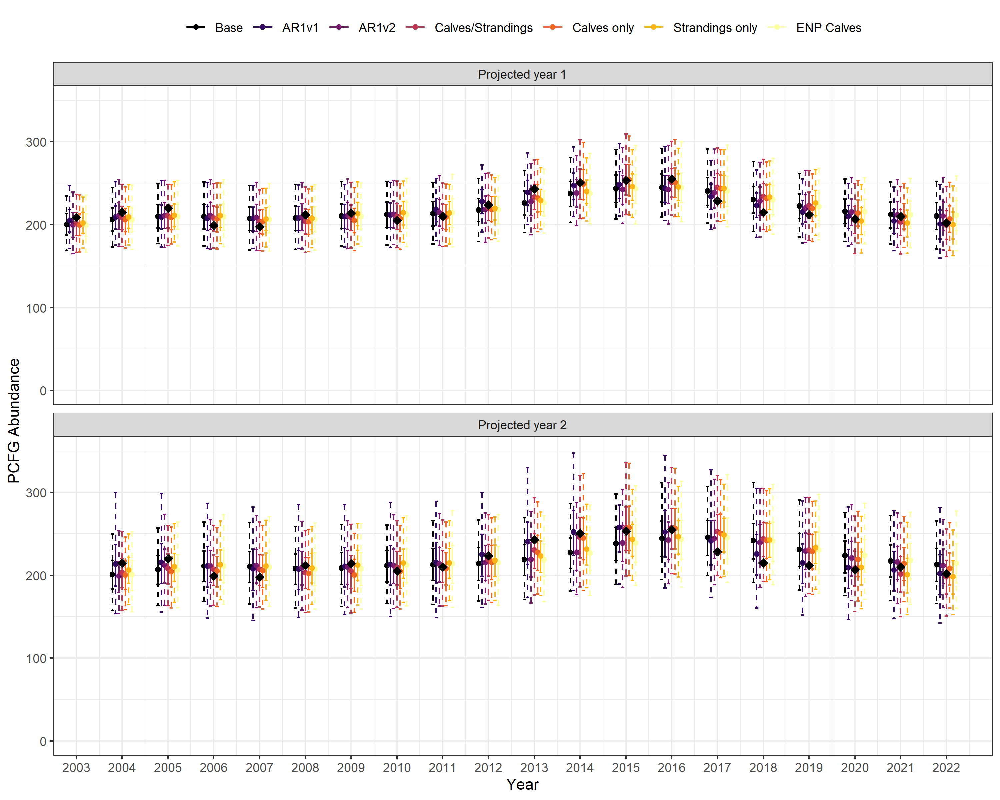
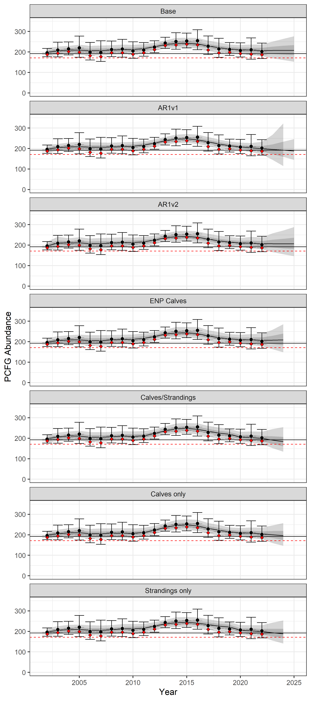
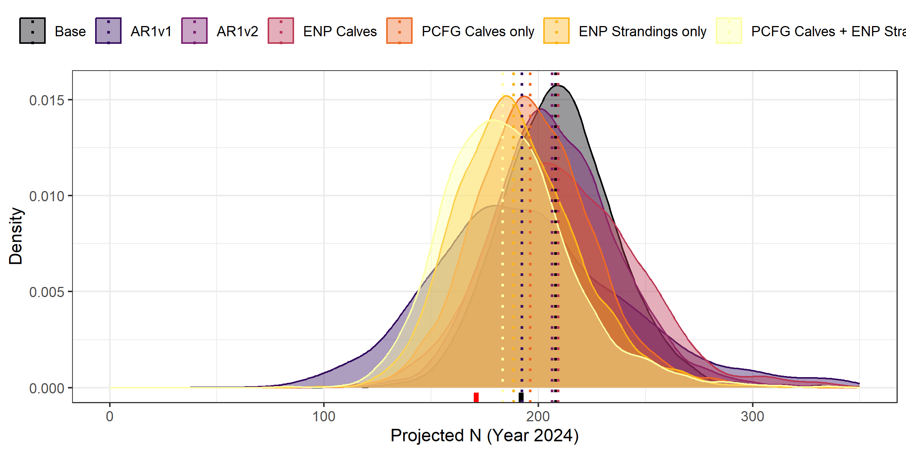

# Projecting PCFG Gray Whale Abundance

# Description of model set

The abundance of gray whales within the Pacific Coast Feeding Group
(PCFG) - a subset of the broader Eastern North Pacific (ENP)
population - is estimated within a Jolly-Seber modeling framework using
data derived from yearly mark-resight surveys (Harris et al. 2024). Due
to the time required to match individuals from many hundreds of
sightings each year to an extensive photographic catalog, the most
recent abundance estimates often lag behind the current calendar year by
one or more years. However, management decisions are contingent upon
abundance estimates for PCFG gray whales through the current calendar
year or into the next. To meet this need, we implemented a Bayesian
state-space model (SSM) to predict abundance beyond the last year for
which PCFG abundance was estimated. The SSM models abundance in
log-space with Gaussian errors and can be defined as the following:

*Observation process:*

")

*State process:*

")

 \sim normal(\mu, \sigma)")

Where

and

are the estimated (log) population abundance and standard error for each
year with observation data, respectively. Models vary by the
specification of

and the factors hypothesized to be correlated with population growth, at
least given current knowledge and available data within this system. At
present, seven models were considered.

1.  Base:
    }; \sigma = \sigma_{ln(\lambda)}")
2.  AR1v1:
    ; \sigma = \sigma_{ln(\lambda)}")
3.  AR2v2:
    } + ln(\lambda_{t-1}) * \beta; \sigma = \sigma_{ln(\lambda)}")
4.  ENP calves:
    } + \beta_{calves} * C_{t}; \sigma = \sigma_{ln(\lambda)}")
5.  (PCFG) Calves only:
    } + \beta_{calves} * C_{t}; \sigma = \sigma_{ln(\lambda)}")
6.  (ENP) Strandings only:
    } + \beta_{strand} * S_{t}; \sigma = \sigma_{ln(\lambda)}")
7.  (PCFG) Calves + Strandings:
    } + \beta_{calves} * C_{t} + \beta_{strand} * S_{t}; \sigma = \sigma_{ln(\lambda)}")

<!--#
&#10;1. Base: $ln(\lambda_{t}) \sim normal(\mu_{ln(\lambda)}, \sigma_{ln(\lambda)})$ 
2. AR1v1: $ln(\lambda_{t}) \sim normal(ln(\lambda_{t-1}), \sigma_{ln(\lambda_{t})})$ 
3. AR2v2: $ln(\lambda_{t}) \sim normal(\mu_{ln(\lambda_{t})} + ln(\lambda_{t-1}) * \beta, \sigma_{ln(\lambda_{t})})$ 
4. ENP calves: $ln(\lambda_{t}) \sim normal(\mu_{ln(\lambda_{t})} + C_{t} * \beta_{calves}, \sigma_{ln(\lambda_{t})})$ 
5. (PCFG) Calves only: $ln(\lambda_{t}) \sim normal(\mu_{ln(\lambda_{t})} + C_{t} * \beta_{calves}, \sigma_{ln(\lambda_{t})})$ 
6. (ENP) Strandings only: $ln(\lambda_{t}) \sim normal(\mu_{ln\lambda} + S_{t} * \beta_{strand}, \sigma_{ln\lambda})$ 
7. (PCFG) Calves + Strandings: $ln(\lambda_{t}) \sim normal(\mu_{ln(\lambda_{t})} + C_{t} * \beta_{calves} + S_{t} * \beta_{strand}, \sigma_{ln(\lambda_{t})})$
&#10;-->

corresponds the number of calves in year *t* (either ENP or PCFG);

corresponds to the number of ENP strandings in year *t*.

### Additional prior specifications

Where appropriate, the following weakly informative hyper-priors were
implemented for both mean and scale parameters in the
")
priors.

} \sim normal(0, 1)")

} \sim lognormal(0, 1)")

Importantly,
}")
is constrained to be positive. For models with beta coefficients (models
4 - 7), additional normal priors are specified for each coefficient, *i*
(e.g.,
"),
ENP calves, PCFG calves, or number of strandings). At present, no
hyper-priors were used for coefficients.

")

# Model fitting diagnostics

The table below provides various chain-specific diagnostics by model
specification. Chains with few to no divergences (num_divergent) and
that do not hit maximum tree depth (num_max_treedepth) indicate adequate
sampling of posteriors and overall good chain performance. Similarly, an
estimated Bayesian fraction of missing information (ebfmi) greater than
0.3 suggests reliable inference can be drawn from posterior estimates.

| Model                        | chain | num_divergent | num_max_treedepth | ebfmi |
|:-----------------------------|:-----:|:-------------:|:-----------------:|:-----:|
| Base                         |   1   |       0       |         0         | 0.47  |
| Base                         |   2   |       0       |         0         | 0.51  |
| Base                         |   3   |       0       |         0         | 0.33  |
| AR1v1                        |   1   |       0       |         0         | 0.35  |
| AR1v1                        |   2   |       0       |         0         | 0.33  |
| AR1v1                        |   3   |       0       |         0         | 0.31  |
| AR1v2                        |   1   |       0       |         0         | 0.54  |
| AR1v2                        |   2   |       0       |         0         | 0.53  |
| AR1v2                        |   3   |       0       |         0         | 0.51  |
| ENP Calves                   |   1   |       0       |         0         | 0.65  |
| ENP Calves                   |   2   |       0       |         0         | 0.59  |
| ENP Calves                   |   3   |       0       |         0         | 0.68  |
| PCFG Calves only             |   1   |       0       |         0         | 0.48  |
| PCFG Calves only             |   2   |       0       |         0         | 0.50  |
| PCFG Calves only             |   3   |       0       |         0         | 0.52  |
| ENP Strandings only          |   1   |       1       |         0         | 0.35  |
| ENP Strandings only          |   2   |       0       |         0         | 0.35  |
| ENP Strandings only          |   3   |       0       |         0         | 0.38  |
| PCFG Calves + ENP Strandings |   1   |       0       |         0         | 0.33  |
| PCFG Calves + ENP Strandings |   2   |       0       |         0         | 0.38  |
| PCFG Calves + ENP Strandings |   3   |       0       |         0         | 0.46  |

# Model results

## Coefficient estimates

coefficient estimates for models where coefficients on

were estimated.

and

correspond to the lower and upper 95% credible intervals.

values less than 1.01 indicate effective mixing within and across
chains, producing reliable and consistent estimates for the parameters.

is the effective sample size and is an indicator of chain sampling
efficiency. Here,

values greater than 300 indicate sufficient sampling has been achieved.

| model                        |                                                               variable                                                                |  mean  | median |  sd   | lo_ci  | hi_ci | rhat  | ess_bulk |
|:-----------------------------|:-------------------------------------------------------------------------------------------------------------------------------------:|:------:|:------:|:-----:|:------:|:-----:|:-----:|:--------:|
| AR1v2                        | }") | -0.167 | -0.170 | 0.382 | -0.784 | 0.463 | 1.004 |  758.2   |
| ENP Calves                   |                       | -0.004 | -0.004 | 0.036 | -0.064 | 0.055 | 1.000 |  1447.6  |
| PCFG Calves only             |                       | 0.020  | 0.019  | 0.019 | -0.010 | 0.051 | 1.001 |  2793.6  |
| ENP Strandings only          |           | -0.002 | -0.002 | 0.001 | -0.004 | 0.001 | 1.000 |  2198.9  |
| PCFG Calves + ENP Strandings |                       | 0.017  | 0.016  | 0.020 | -0.016 | 0.050 | 1.004 |  2694.3  |
| PCFG Calves + ENP Strandings |           | -0.001 | -0.001 | 0.002 | -0.004 | 0.001 | 1.002 |  1998.7  |

## Leave-one-out Cross Validation (LOO)

Derived estimates of model fit using an information criterion based on
leave-one-out cross validation (looic). Models with the lowest

value are considered the best fitting model given the time series of
abundance data used to fit the model.

represents the difference in

relative to the model with the lowest
.

| Model                        | elpd_loo | p_loo | looic  | deltaLooic |
|:-----------------------------|:--------:|:-----:|:------:|:----------:|
| AR1v1                        |  25.55   | 2.37  | -51.11 |    0.00    |
| PCFG Calves only             |  24.78   | 2.84  | -49.56 |    1.54    |
| ENP Strandings only          |  24.44   | 2.88  | -48.89 |    2.22    |
| PCFG Calves + ENP Strandings |  24.32   | 3.09  | -48.65 |    2.46    |
| Base                         |  24.22   | 3.11  | -48.44 |    2.66    |
| ENP Calves                   |  23.86   | 3.37  | -47.71 |    3.39    |
| AR1v2                        |  23.34   | 3.73  | -46.69 |    4.42    |

## Predictive accuracy with retrospection

Model fit statistics for predicting one year forward for all data years
from 2002 through 2021. RSS is the residual sum of squares.

| Model                        | Mean RSS | Mean Percentile (N) | Median Percentile (N) | Lower 95% CI for Percentile (N) | Upper 95% CI for Percentile (N) | Prop Below Threshold (N) | Prop Below Threshold (Nmin) | Number of Closures |
|:-----------------------------|:--------:|:-------------------:|:---------------------:|:-------------------------------:|:-------------------------------:|:------------------------:|:---------------------------:|:------------------:|
| AR1v1                        | 1333782  |        0.519        |         0.583         |              0.308              |              0.744              |          0.123           |            0.017            |         0          |
| ENP Strandings only          | 1377657  |        0.518        |         0.569         |              0.186              |              0.775              |          0.122           |            0.016            |         0          |
| Base                         | 1413790  |        0.513        |         0.530         |              0.246              |              0.803              |          0.110           |            0.013            |         0          |
| PCFG Calves only             | 1435932  |        0.522        |         0.528         |              0.218              |              0.743              |          0.138           |            0.017            |         0          |
| PCFG Calves + ENP Strandings | 1469416  |        0.521        |         0.571         |              0.192              |              0.722              |          0.145           |            0.021            |         0          |
| AR1v2                        | 1608977  |        0.514        |         0.526         |              0.268              |              0.775              |          0.121           |            0.017            |         0          |
| ENP Calves                   | 1610132  |        0.527        |         0.542         |              0.279              |              0.801              |          0.126           |            0.017            |         0          |

Model fit statistics for predicting two years forward for all data years
from 2002 through 2021. RSS is the residual sum of squares.

| Model                        | Mean RSS | Mean Percentile (N) | Median Percentile (N) | Lower 95% CI for Percentile (N) | Upper 95% CI for Percentile (N) | Prop Below Threshold (N) | Prop Below Threshold (Nmin) | Number of Closures |
|:-----------------------------|:--------:|:-------------------:|:---------------------:|:-------------------------------:|:-------------------------------:|:------------------------:|:---------------------------:|:------------------:|
| ENP Strandings only          | 2479358  |        0.509        |         0.576         |              0.153              |              0.817              |          0.154           |            0.036            |         0          |
| Base                         | 2623142  |        0.504        |         0.465         |              0.173              |              0.854              |          0.147           |            0.030            |         0          |
| PCFG Calves only             | 2690216  |        0.509        |         0.519         |              0.173              |              0.776              |          0.185           |            0.042            |         0          |
| PCFG Calves + ENP Strandings | 2761271  |        0.509        |         0.512         |              0.151              |              0.725              |          0.188           |            0.048            |         0          |
| AR1v2                        | 2923377  |        0.509        |         0.469         |              0.228              |              0.826              |          0.163           |            0.039            |         0          |
| ENP Calves                   | 3037646  |        0.512        |         0.459         |              0.209              |              0.846              |          0.165           |            0.040            |         0          |
| AR1v1                        | 4039921  |        0.500        |         0.512         |              0.365              |              0.604              |          0.203           |            0.071            |         0          |

## Model-specific trends and projections

Note, the number of PCFG calves used in projected years (models
Calves/Strandings and Calves only) are not accurate and likely represent
underestimates of reality.

## Model-specific predictions for Yfinal + 2

